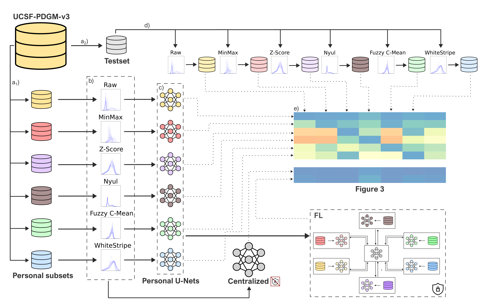

# Can Federated Learning Overcome This Heterogeneity?

## Experiment pipeline



## Abstract 
Deep learning (DL) has been increasingly applied across various fields, including medical imaging, where it often outperforms traditional approaches. However, DL requires large amounts of data, which raises many challenges related to data privacy, storage, and transfer. Federated learning (FL) is a training paradigm that overcomes these issues, though its effectiveness may be reduced when dealing with non-independent and identically distributed (non-IID) data. This study simulates non-IID conditions by applying different MRI intensity normalization techniques to separate data subsets, reflecting a common cause of heterogeneity. These subsets are then used for training and testing models for brain tumor segmentation. The findings provide insights into the influence of the MRI intensity normalization methods on segmentation models, both training and inference. Notably, the FL methods demonstrated resilience to inconsistently normalized data across clients, achieving the 3D Dice score of 92\%, which is comparable to a centralized model (trained using all data). These results indicate that FL is a solution to effectively train high-performing models without violating data privacy, a crucial concern in medical applications.

## Installation
All dependencies are listed in `requirements.txt`:

```bash
pip install -r requirements.txt
```

## Configuration
The main configuration file is `configs/config.py`. Key settings include:

```python
# Training Parameters
BATCH_SIZE = 32
LEARNING_RATE = 0.001
N_EPOCHS_CENTRALIZED = 10  # epochs for classical training

# FL Parameters
N_ROUNDS = 32
MIN_FIT_CLIENTS = MIN_AVAILABLE_CLIENTS = 2
FRACTION_FIT = 1.0

# Data Settings
USED_MODALITIES = ["t1", "t2", "flair"]  # MRI modalities
MASK_DIR = 'mask'  # Directory containing mask files
```

## Running Training

### Classical (Centralized) Training
Train on a single dataset:
```bash
python exe/trainings/classical_train.py <data_directory> [num_epochs]
```

Train on all available datasets:
```bash
python exe/trainings/classical_train.py all [num_epochs]
```

### Federated Learning

1. Start the server:
```bash
python exe/trainings/run_server.py [port_number] [strategy_name]
# Default: port=8088, strategy=fedavg
```

2. Start clients (run multiple times for different clients):
```bash
python exe/trainings/run_client_train.py <data_directory> <client_id> <server_address> <strategy_name>
```

Example local setup:
```bash
# Start server
python exe/trainings/run_server.py 8088 fedavg

# Start client
python exe/trainings/run_client_train.py /path/to/data 1 127.0.0.1:8088 fedavg
```


## Results
Presentation of the predictions for each of the trained models on the 0229 patient. It presents the normalized inputs and the models’ predictions with distinction for true positive, false negative, and false positive

